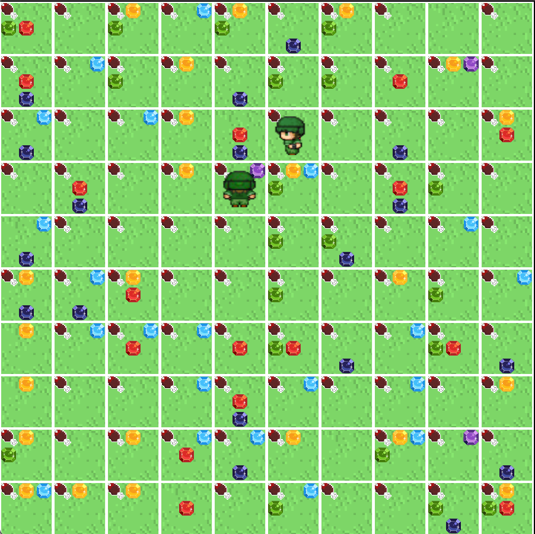

# ZAPPY #

### Server
*Compilation :*
```$ make re```<br/>
*Usage :* ```./zappy_server -p port -x width -y height -n name1 name2 ... -c clientsNb -f freq```
* **port** is the port number<br/>
* **width** is the width of the world<br/>
* **height** is the height of the world<br/>
* **nameX** is the name of the team X<br/>
* **clientsNb** is the number of authorized clients per team<br/>
* **freq** is the reciprocal of time unit for execution of actions<br/>

### Ai
*Compilation :*
```$ make re```<br/>
*Usage :* ```./zappy_ai -p port -n name -h machine```<br/>
* **port** is the port number<br/>
* **name** is the name of the team<br/>
* **machine** is the name of the machine; localhost by default

### Graphic
*Compilation :*
```$ cd ./gui && make```<br/>
*USAGE :* ```./zappy_gui host port```<br/>
* **host** is the host of the server<br/>
* **port** is the port number<br/>


## Gameplay
### Protocole commands AI

|**Action**|**command**|**time limit**|**response**|
|:-:|:-:|:-:|:-:|
|move up one tile<br/>turn 90° right<br/>turn 90° left|Forward<br/>Right<br/>Left<br/>|7/f<br/>7/f<br/>7/f<br/>|ok<br/>ok<br/>ok<br/>|
|look around<br/>inventory<br/>broadcast text<br/>|Look<br/>Inventory<br/>Broadcast text<br>|7/f<br/>1/f<br/>7/f<br/>|[tile1, tile2,...]<br/>[linemate *n*, sibur *n*, ...]<br/>ok<br/>|
|number of team unused slots<br/>fork a player<br/>eject players from this tile<br/>death of a player<br/>|Connect_nbr<br/>Fork<br/>Eject<br/>-<br/>|-<br/>42/f<br/>7/f<br/>-<br/>|value<br/>ok<br/>ok/ko<br/>dead<br/>|
|take object<br/>set object down<br/>start incantation<br/>|Take object<br/>Set object<br/>Incantation<br/>|7/f<br/>7/f<br/>300/f<br/>|ok/ko<br/>ok/ko<br/>Evaluation underway<br/>Current level: k<br/>/ko<br/>|

### Resources
* food
* linemate
* deraumere
* sibur
* mendiane
* phiras
* thystame

### Elevation ritual
|**Elevation**|**nb of players**|**linemate**|**deraumere**|**sibur**|**mendiane**|**phiras**|**thystame**|
|:-:|:-:|:-:|:-:|:-:|:-:|:-:|:-:|
|**1->2**|1|1|0|0|0|0|0|
|**2->3**|2|1|1|1|0|0|0|
|**3->4**|2|2|0|1|0|2|0|
|**4->5**|4|1|1|2|0|1|0|
|**5->6**|4|1|2|1|3|0|0|
|**6->7**|6|1|2|3|0|1|0|
|**7->8**|6|2|2|2|2|2|1|

## Graphical protocole

### Map



### Commands
|**Symbol**|**Meaning**|**Symbol**|**Meaning**|
|:-:|:-:|:-:|:-:|
|**X**|width or horizontal position|**n**|player number|
|**Y**|height or vertical position|**O**|orientation: 1(N), 2(E), 3(S), 4(W)|
|**q0**|resource 0 (food) quantity|**L**|player or incantation level|
|**q1**|resource 1 (linemate) quantity|**e**|egg number|
|**q2**|resource 2 (deraumere) quantity|**T**|time unit|
|**q3**|resource 3 (sibur) quantity|**N**|name of the team|
|**q4**|resource 4 (mendiane) quantity|**R**|incantation result|
|**q5**|resource 5 (phiras) quantity|**M**|message|
|**q6**|resource 6 (thystame) quantity|**i**|resource number|

|**Server**|**Client**|**Details**|
|:-:|:-:|:-:|
|msz X Y\n|msz\n|map size|
|bct X Y q0 q1 q2 q3 q4 q5 q6\n|bct X Y\n|ontent of a tile|
|bct X Y q0 q1 q2 q3 q4 q5 q6\n * nbr_tile|mct\n|content of the map (all the tiles)|
|tna N\n * nbr_teams|tna\n|name of all the teams|
|pnw #n X Y O L N\n||connection of a new player|
|ppo n X Y O\n|ppo #n\n |layer’s position|
|plv n L\n|plv #n\n |layer’s level|
|pin n X Y q0 q1 q2 q3 q4 q5 q6\n|pin #n\n|layer’s inventory|
|pex n\n||explusion|
|pbc n M\n||broadcast|
|pic X Y L n n . . . \n||start of an incantation (by the first player)|
|pie X Y R\n||end of an incantation|
|pfk n\n||egg laying by the player|
|pdr n i\n||resource dropping|
|pgt n i\n||resource collecting|
|pdi n\n||death of a player|
|enw e n X Y\n||an egg was laid by a player|
|eht e\n||egg hatching|
|ebo e\n||player connection for an egg|
|edi e\n||death of an hatched egg|
|sgt T\n|sgt\n|time unit request|
|sst T\n|sst T\n|time unit modification|
|seg N\n||end of game|
|smg M\n||message from the server|
|suc\n||unknown command|
|sbp\n||command parameter|
